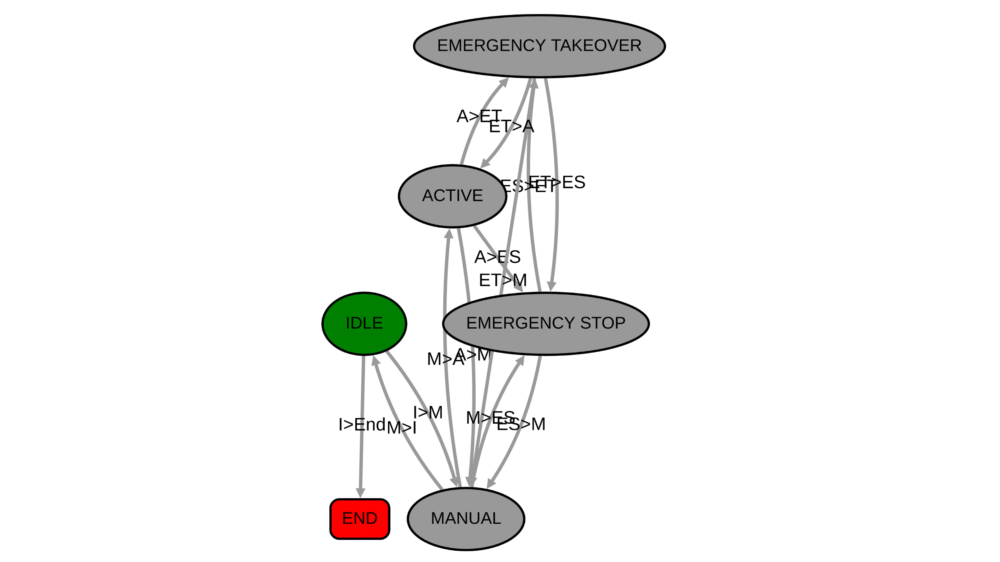

# Supervisor Node
<p align="center">
  
</p>

The [Supervisor Node](src/supervisor_node) is responsible for storing the overall health state of the vehicle through
a finite state machine, which here has been implemented using [YASMIN](https://github.com/uleroboticsgroup/yasmin) library. 
The node's output is the state of the FSM and is published as a topic.


## Table of Contents
1. [Installation](#installation)
2. [Index](#index)
3. [Specs](#specs)
   - [Definitions](#definitions)
   - [States](#states)
   - [Transitions](#transitions)
4. [Usage](#usage)
5. [Demo](#demo)
6. [Citations](#citations)

     
## Installation
- Sourcing ROS2 underlay (foxy distro in this case):
```shell
source /opt/ros/foxy/setup.bash
```

- Cloning packages:
```shell
cd ~/ros2_ws/src
git clone https://github.com/uleroboticsgroup/simple_node.git
git clone https://github.com/uleroboticsgroup/yasmin.git
git clone https://github.com/england00/supervisor_node.git
```

- Installing dependencies:
```shell
cd yasmin
pip3 install -r requirements.txt
cd ../..
rosdep install --ignore-src --from-paths src -y -r
```

- Building the workspace:
```shell
colcon build
```


## Index
- [SupervisorNode](.)
    - [CMake File](./CMakeLists.txt)
    - [Documents](./docs)
        - [Logo](docs/logo.JPG)
        - [Presentation](docs/Hakertz_RTES_Presentation.pptx)
        - [Specifications File](docs/FSM-Specs.pdf)
    - [Launch Files](launch)
        - [Demo](launch/demo.py)
    - [Package XML](./package.xml)
    - [Source Files](src)
        - [External State Selector Node](src/external_state_selector_node)
        - [Pub/Sub Simulator Node](src/pub_sub_simulator_node)
        - [Supervisor Node](src/supervisor_node)


## Specs
### Definitions
- **Primary Driving Stack**: high-performance autonomous driving solution but prone to failures or potentially hazardous conditions;
- **Secondary Driving Stack**: less performant but more reliable and conservative autonomous driving solution;
- **Common Failure**: a condition where autonomous driving with the primary stack cannot proceed, in which:
    - a critical node becomes unresponsive (misses a certain number of deadlines);
    - there is an identification of a risky situation for the vehicle (loss of grip, steering commands leading to a certain collision, etc.);
- **Severe Failure**: a hardware component becomes unresponsive, so:
    - a failure in sensor or actuator drivers.

### States
The node implements the following states:
- **Idle [I]**: the node is active and awaits signals from the outside;
- **Manual [M]**: the vehicle is in manual driving mode:
    - no fault checks are performed in this state;
    - all driving commands from the primary and secondary stacks are ignored;
- **Active [A]**: The vehicle is in autonomous driving mode:
    - fault checks are performed in this state;
    - control is entrusted to the primary driving stack;
- **Emergency Takeover [ET]**: the vehicle is in a risky state:
    - control is entrusted to the secondary driving stack;
- **Emergency Stop [ES]**: the vehicle is unable to move autonomously:
    - driving commands are ignored, and the vehicle is stopped in place.
 
### Transitions
The node implements the following state transitions:
- **(I) ←→ (M)**: service callable from the outside;
- **(M) ←→ (A)**: service callable from the outside;
- **(A) → (ET)**: a common fault occurs;
- **(ET) → (A)**: the common fault is resolved;
- **(ET) → (M)**: service callable from the outside;
- **(A, M, ET) → (ES)**: a severe fault occurs;
- **(ES) → (ET)**: the severe fault is resolved, and the node entered ES state from A or ET;
- **(ES) → (M)**: the severe fault is resolved, and the node entered ES state from M.


## Usage
In order to work, the supervisor node communicates with the other available nodes through the presence of the following topics:
- *supervisor_node/state_selection*, in which it is **subscribed** to _change state_ with calls from an outer service (**note**: sending END state on this topic will terminate the execution of the node);
- *supervisor_node/manual_command*, in which it is **subscribed** to receive notifications of _manual commands_ given by an outer service to the system inside the **Manual** state;
- *supervisor_node/primary_driving_stack*, in which it is **subscribed** to receive notifications of the execution of _Primary Driving Stack_ imposed by an outer service to the system inside the **Active** state (**note**: here a MISSED DEADLINE pulls the transition to the **Emergency Takeover** state);
- *supervisor_node/common_fault*, in which it is **subscribed** to receive any common faults during the **Active** state and thus transition to the **Emergency Takeover** state;
- *supervisor_node/secondary_driving_stack*, in which it is **subscribed** to receive notifications of the execution of _Secondary Driving Stack_ imposed by an outer service to the system inside the **Emergency Takeover** state (**note**: here a MISSED DEADLINE pulls the transition to the **Emergency Stop** state);
- *supervisor_node/general_sensor_or_actuator_driver_response*, in which it is **subscribed** to receive messages from any hardware or software components connected to the system, which communicate their liveliness (**note**: here a LOST LIVELINESS pulls the transition to the **Emergency Stop** state);
- *supervisor_node/current_state*, in which the _current state_ of the node FSM is **published** as output for any outer service.

To run the [Supervisor Node](src/supervisor_node) open one terminal window and follow these commands:
```shell
cd ~/ros2_ws
source /opt/ros/foxy/setup.bash
source install/local_setup.bash
ros2 run supervisor_node supervisor_node
```

## Demo
Within the repository, two additional nodes are included for working with the [Supervisor Node](src/supervisor_node) for a demonstration purpose:
- [External State Selector Node](src/external_state_selector_node), which simulates normal state transitions of the FSM invoked externally by keyboard inputs given by the user;
- [Pub/Sub Simulator Node](src/pub_sub_simulator_node), that automatically publishes and subscribes in all the available topics, simulating all the possible states and transitions in which the FSM can go through.

To run the demo open three terminal window and follow these commands for each one:
- Terminal 1:
```shell
cd ~/ros2_ws
source /opt/ros/foxy/setup.bash
source install/local_setup.bash 
ros2 run supervisor_node supervisor_node
```
- Terminal 2:
```shell
cd ~/ros2_ws
source /opt/ros/foxy/setup.bash
source install/local_setup.bash 
ros2 run supervisor_node external_state_selector_node
```
- Terminal 3:
```shell
cd ~/ros2_ws
source /opt/ros/foxy/setup.bash
source install/local_setup.bash 
ros2 run supervisor_node pub_sub_simulator_node
```

Otherwise, a [Launch File](launch/demo.py) is provided for calling the execution of all the nodes together within a single terminal window: 
```shell
cd ~/ros2_ws
source /opt/ros/foxy/setup.bash
source install/local_setup.bash 
ros2 launch supervisor_node demo.py
```
In this case is added a further node execution, provided by [YASMIN](https://github.com/uleroboticsgroup/yasmin) library. 
This last one, called Yasmin Viewer Node, enables a web service on [localhost](http://localhost:5000/) in which is represented the execution of current states and transitions of the FSM with a graph.


## Citations
```bibtex
@InProceedings{10.1007/978-3-031-21062-4_43,
author="Gonz{\'a}lez-Santamarta, Miguel {\'A}.
and Rodr{\'i}guez-Lera, Francisco J.
and Matell{\'a}n-Olivera, Vicente
and Fern{\'a}ndez-Llamas, Camino",
editor="Tardioli, Danilo
and Matell{\'a}n, Vicente
and Heredia, Guillermo
and Silva, Manuel F.
and Marques, Lino",
title="YASMIN: Yet Another State MachINe",
booktitle="ROBOT2022: Fifth Iberian Robotics Conference",
year="2023",
publisher="Springer International Publishing",
address="Cham",
pages="528--539",
abstract="State machines are a common mechanism for defining behaviors in robots where each behavior is based on identifiable stages. There are several libraries available for easing the implementation of state machines in ROS 1, however, the community was focused on SMACH or SMACC. Although these tools are still predominant, there are fewer alternatives for ROS 2. Besides, Behavior Trees are spreading fast, but there is a niche for using State Machines. Here, YASMIN is presented as yet another library specifically designed for ROS 2 for easing the design of robotic behaviors using state machines. It is available in C++ and Python, and provides some default states to speed up the development, in addition to a web viewer for monitoring the execution of the system and helping in the debugging.",
isbn="978-3-031-21062-4"
}

```

```bibtex
@misc{yasmin,
  doi = {10.48550/ARXIV.2205.13284},
  url = {https://arxiv.org/abs/2205.13284},
  author = {González-Santamarta, Miguel Ángel and Rodríguez-Lera, Francisco Javier and Llamas, Camino Fernández and Rico, Francisco Martín and Olivera, Vicente Matellán},
  keywords = {Robotics (cs.RO), FOS: Computer and information sciences, FOS: Computer and information sciences},
  title = {YASMIN: Yet Another State MachINe library for ROS 2},
  publisher = {arXiv},
  year = {2022},
  copyright = {Creative Commons Attribution Non Commercial No Derivatives 4.0 International}
}
```
