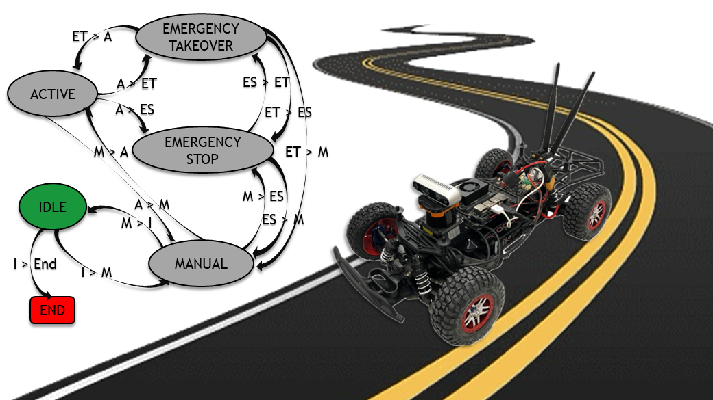

# SupervisorNode

<p align="center">
  
</p>

The [Supervisor Node](src/supervisor_node.cpp) is responsible for storing the overall health state of the vehicle through
a finite state machine, which here has been implemented using [YASMIN](https://github.com/uleroboticsgroup/yasmin) library. 
The node's output is the state of the FSM and is published as a topic.

## Table of Contents

1. [Installation](#installation)
2. [Index](#index)
3. [Specs](#specs)
   - [Definitions](#definitions)
   - [States](#states)
   - [Transitions](#transitions)
4. [Demo](#demo)
     
## Installation
- Sourcing ros2 underlay (foxy distro in this case):
```shell
$ source /opt/ros/foxy/setup.bash
```

- Cloning packages:
```shell
$ cd ~/ros2_ws/src
$ git clone https://github.com/uleroboticsgroup/simple_node.git
$ git clone https://github.com/uleroboticsgroup/yasmin.git
$ git clone https://github.com/england00/SupervisorNode.git
```

- Installing dependencies:
```shell
$ cd yasmin
$ pip3 install -r requirements.txt
$ cd ../..
$ cd rosdep install --ignore-src --from-paths src -y -r
```

- Building the workspace:
```shell
$ colcon build
```

## Index
- [SupervisorNode](.)
    - [CMake File](./CMakeLists.txt)
    - [Documents](./docs)
        - [Logo](docs/logo.JPG)
        - [Specifications File](docs/FSM-Specs.pdf)
    - [Launch Files](launch)
        - [Demo](launch/demo.py)
    - [Package XML](./package.xml)
    - [Source Files](src)
        - [Failure Simulator](src/failure_simulator.cpp)
        - [State Selector](src/state_selector.cpp)
        - [Supervisor Node](src/supervisor_node.cpp)
    
## Specs
### Definitions
- **Primary Driving Stack**: high-performance autonomous driving solution but prone to failures or potentially hazardous conditions;
- **Secondary Driving Stack**: less performant but more reliable and conservative autonomous driving solution;
- **Common Failure**: a condition where autonomous driving with the primary stack cannot proceed, in which:
    - a critical node becomes unresponsive (misses a certain number of deadlines);
    - there is an identification of a risky situation for the vehicle (loss of grip, steering commands leading to a certain collision, etc.);
- **Severe Failure**: a hardware component becomes unresponsive, so:
    - a failure in sensor or actuator drivers.

### States
The node implements the following states:
- **Idle [I]**: the node is active and awaits signals from the outside;
- **Manual [M]**: the vehicle is in manual driving mode:
    - no fault checks are performed in this state;
    - all driving commands from the primary and secondary stacks are ignored;
- **Active [A]**: The vehicle is in autonomous driving mode:
    - fault checks are performed in this state;
    - control is entrusted to the primary driving stack;
- **Emergency Takeover [ET]**: the vehicle is in a risky state:
    - control is entrusted to the secondary driving stack;
- **Emergency Stop [ES]**: the vehicle is unable to move autonomously:
    - driving commands are ignored, and the vehicle is stopped in place.
 
### Transitions
The node implements the following state transitions:
- **(I) ←→ (M)**: service callable from the outside;
- **(M) ←→ (A)**: service callable from the outside;
- **(A) → (ET)**: a common fault occurs;
- **(ET) → (A)**: the common fault is resolved;
- **(ET) → (M)**: service callable from the outside;
- **(A, M, ET) → (ES)**: a severe fault occurs;
- **(ES) → (ET)**: the severe fault is resolved, and the node entered ES state from A or ET;
- **(ES) → (M)**: the severe fault is resolved, and the node entered ES state from M.

## Demo
Within the repository, two additional nodes are included for working with the [Supervisor Node](src/supervisor_node.cpp) for a demonstration purpose:
- [State Selector](src/state_selector.cpp), which simulates state transitions of the FSM invoked externally by keyboard inputs given by the user;
- [Failure Simulator](src/failure_simulator.cpp), that automatically provides some possibily errors the system can face with, stimulating respective responses by the machine.

To run the demo open three terminal window and follow these commands for each one:
```shell
$ cd ~/ros2_ws/src
$ source /opt/ros/foxy/setup.bash
$ source install/local_setup.bash 
```
- Terminal 1:
```shell
$ ros2 run supervisor_node supervisor_node
```
- Terminal 2:
```shell
$ ros2 run supervisor_node state_selector
```
- Terminal 3:
```shell
$ ros2 run supervisor_node failure_simulator
```

Otherwise, a [Launch File](launch/demo.py) is provided for calling the execution of all the nodes together with just this single command: 
```shell
$ ros2 launch supervisor_node demo.py
```
In this case is added a further node execution, provided by [YASMIN](https://github.com/uleroboticsgroup/yasmin) library. 
This node, called Yasmin Viewer Node, enables a web service on [localhost](http://localhost:5000/) in which is represented the execution of current states and transitions of the FSM with a graph.
